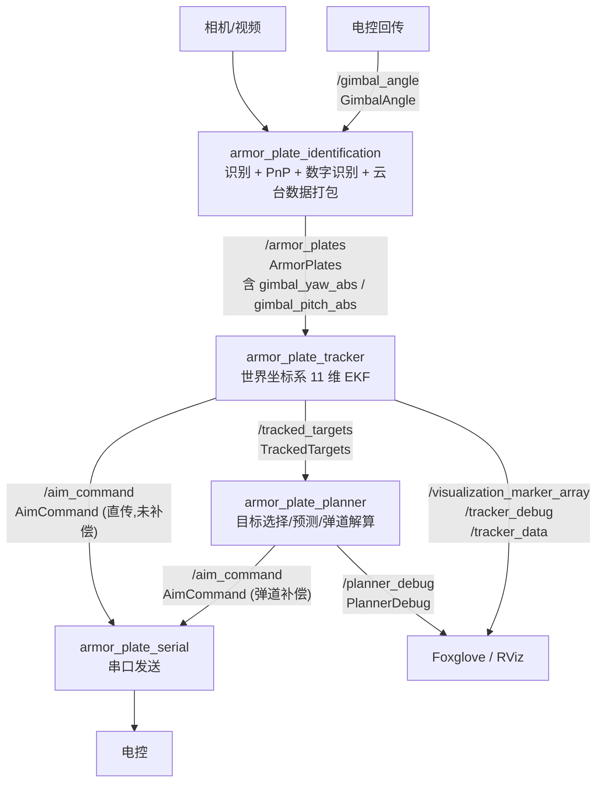

# RoboMaster 装甲板视觉识别系统

基于 **ROS 2 Jazzy/Humble** + **OpenCV 4.x** + **OpenVINO Runtime** 的装甲板识别、跟踪与瞄准解算方案。当前开发环境为 **ROS 2 Jazzy**。

---

## 项目简介

完整的视觉处理链路：图像采集 → 预处理 → 灯条检测与配对 → 数字识别 → PnP 位姿解算 → 世界坐标系扩展卡尔曼滤波跟踪 → 目标选择/预测/弹道解算 → 串口通信。

支持**相机实时运行**与**离线视频调试**两种模式。

---

## 数据流



**消息说明**

| Topic | 类型 | 说明 |
|-------|------|------|
| `/armor_plates` | `ArmorPlates` | 检测到的装甲板数组（含位姿、数字、图像中心距、云台绝对角） |
| `/gimbal_angle` | `GimbalAngle` | 电控回传的绝对 yaw/pitch（带时间戳） |
| `/tracked_targets` | `TrackedTargets` | EKF 跟踪输出的全部目标列表（含中心、速度、yaw、几何参数、匹配装甲板） |
| `/aim_command` | `AimCommand` | 控制指令（delta_yaw, delta_pitch，单位 rad）；Planner 弹道补偿后发布 |
| `/planner_debug` | `PlannerDebug` | Planner 调试信息：原始/预测/弹道补偿世界坐标点、飞行时间、朝向评分 |
| `/tracker_debug` | `TrackerDebug` | 相机系测量/滤波点 + 世界系四个预测装甲板 `xyza` 与 selected id（Identification/Test 侧按装甲板 pitch=15° 重投影） |
| `/tracker_data` | `TrackerData` | measurement/filter 的 yaw/pitch |
| `/visualization_marker_array` | `MarkerArray` | 旋转中心、速度、观测装甲板、滤波装甲板和四块预测装甲板 |

---

## 功能包说明

| 功能包 | 职责 | 节点 | 订阅 | 发布 |
|--------|------|------|------|------|
| `armor_plate_identification` | 图像采集、预处理、灯条检测、PnP、数字识别、云台数据打包 | `ArmorPlateIdentification` (相机) / `Test` (视频) | `/gimbal_angle` | `/armor_plates`, TF |
| `armor_plate_tracker` | 目标选择、世界坐标系 11 维 EKF | `armor_plate_tracker_node` | `/armor_plates` | `/aim_command`, `/tracked_targets`, `/tracker_debug`, `/tracker_data`, `/visualization_marker_array` |
| `armor_plate_planner` | 目标选择、运动预测、弹道解算、瞄准指令生成 | `armor_plate_planner_node_cpp` | `/tracked_targets`, `/gimbal_angle` | `/aim_command`, `/planner_debug` |
| `armor_plate_serial` | 串口双向通信 | `serial_node` | `/aim_command` | `/gimbal_angle`, (串口) |
| `armor_plate_interfaces` | 自定义消息定义 | — | — | — |
| `armor_plate_common` | 公共数学/几何工具（角度、YPR/YPD、坐标系旋转） | — | — | — |
| `armor_plate_bringup` | 一键启动组合 | `run.launch.py` / `test.launch.py` / `auto_test.launch.py` | — | — |

---

## 技术特点

### 1. 预处理

- 灰度转换 → 固定阈值二值化 → 膨胀
- 不依赖颜色通道，过曝/杂光场景更鲁棒
- 支持 `target_color` 参数切换红/蓝方（用于数字识别与后续逻辑）

### 2. 灯条检测与匹配

- **灯条检测**：轮廓筛选（面积 + 长宽比）→ `fitEllipse` 方向 + `minAreaRect` 长度约束
- **配对流程**：O(n²) 暴力枚举所有灯条对 → 逐级过滤
  - 颜色检查：两灯条必须同色且等于目标色
  - 几何检查：角度差、长度比、x/y 偏差比、距离比共 5 项阈值
  - 数字分类：OpenVINO 推理 + 类型检查
- **去重逻辑**：共享灯条的候选装甲板按 ROI 面积或置信度二选一

### 3. 数字识别

- 装甲板中心 ROI 透视变换提取
- **OpenVINO Runtime** 推理，输出 0-9 + negative
- 模型文件：`model/number_cnn.onnx`
- 训练工具链见 `DeepLearning/`

### 4. PnP 位姿解算

- `cv::solvePnP` 解算 `tvec` + 四元数
- 动态读取 `CameraInfo` 获取相机内参与畸变系数

### 5. 目标跟踪（世界坐标系 EKF）

- **云台数据**：Identification 订阅 `/gimbal_angle` 并打包进 `ArmorPlates` 消息（`gimbal_yaw_abs`、`gimbal_pitch_abs`），Tracker 直接读取，无需独立时间对齐。
- **坐标变换**：`CoordinateTransformer` 实现 camera → gimbal（固定旋转）→ world（动态 yaw/pitch）旋转链。
- **11 状态 EKF**：`[x_c, v_x, y_c, v_y, z_c, v_z, yaw, omega, r, l, h]`
  - `x_c, y_c, z_c`：目标旋转中心位置。
  - `yaw, omega`：目标自转角和自转角速度。
  - `r`：`id=0/2` 装甲板半径。
  - `r + l`：`id=1/3` 装甲板半径。
  - `z_c + h`：`id=1/3` 装甲板高度。
- **装甲板几何模型**：普通 `1-5` 目标统一按四装甲板模型处理。
  - `angle_i = yaw + i * PI / 2`
  - `id=0/2` 时 `radius = r`
  - `id=1/3` 时 `radius = r + l`
  - `id=0/2` 时 `armor_z = z_c`
  - `id=1/3` 时 `armor_z = z_c + h`
  - `armor_x = x_c - radius * cos(angle_i)`
  - `armor_y = y_c - radius * sin(angle_i)`
  - `armor_angle = angle_i`
- **观测量**：`[yaw_to_armor, pitch_to_armor, distance_to_armor, armor_yaw]`，由预测装甲板 `xyza` 转为 `ypda` 后与 PnP 观测比较。
- **过程噪声**：`x/v_x`、`y/v_y`、`z/v_z`、`yaw/omega` 使用分段白噪声加速度模型，`r/l/h` 当前视为静态几何参数。
- **约束**：`yaw` 归一化到 `[-PI, PI]`；`r` 与 `r + l` 限制在 `[0.05, 0.5] m`。
- **目标选择**：未初始化时选图像中心最近；已初始化时沿用当前世界系预测位置最近的简单匹配机制。
- **丢失处理**：无目标时只预测；`max_lost_time=0.5s` 超时重置。
- **Debug 重投影**：`TrackerDebug` 回传四个预测装甲板 `xyza`（世界系中心点 + 世界系 yaw）和 `selected_armor_id`；Identification/Test 侧用图像缓存同步到的 `gimbal_yaw_abs/gimbal_pitch_abs`，并按参考工程假设普通装甲板自身 `pitch=15°`，重建 `135mm x 55mm` 矩形投影到 `tracker_debug` 图像窗口。Test 视频模式默认虚拟云台 `pitch=0°`，需要模拟云台姿态时通过参数覆盖。

### 6. Planner 弹道解算

- **目标选择**：从 `TrackedTargets` 中选取最优跟踪目标。
- **运动预测**：基于 EKF 状态预测目标在未来 `prediction_time` 时刻的位置（当前未实现，dt=0）。
- **装甲板选择**：根据 `cos(armor_yaw - yaw_to_armor)` 朝向评分选择正对射手的装甲板（详见 [facing_score 公式](docs/不用讨论/armor_plate_planner/facing_score公式.md)）。
- **弹道补偿**：无阻力低弹道解析解，输出补偿后的瞄准点。
- **坐标变换**：`CommandGenerator` 使用 `R_gimbal_world` 矩阵将目标从世界系变换到云台系，再用 `calculateYPD` 计算 delta 角度。
- **调试输出**：`/planner_debug` 发布原始点、预测点、弹道补偿点，Foxglove 可视化。

### 7. 串口双向通信

**视觉 → 电控** (`0xA5 0x5A`)：
```c
typedef struct {
    uint8_t  sof1;              // 0xA5
    uint8_t  sof2;              // 0x5A
    uint8_t  seq;
    uint8_t  target_valid;
    int16_t  delta_yaw_1e4rad;
    int16_t  delta_pitch_1e4rad;
    uint16_t crc16;             // CRC16/MODBUS，前8字节
} VisionToEcFrame_t;
```

**电控 → 视觉** (`0x5A 0xA5`)：
```c
typedef struct {
    uint8_t  sof1;              // 0x5A
    uint8_t  sof2;              // 0xA5
    uint8_t  seq_echo;
    int32_t  yaw_actual_1e4rad;
    int32_t  pitch_actual_1e4rad;
    uint16_t crc16;             // CRC16/MODBUS，前11字节
} EcToVisionFrame_t;
```

- 发送：订阅 `/aim_command` 即时发送，`int16_t = rad * 10000.0f`
- 接收：独立线程 + 状态机解析，解析成功后填充 `stamp = now()` 发布 `/gimbal_angle`
- 无目标时自动停发

---

## 快速开始

### 环境依赖

当前开发环境：Ubuntu 24.04 + ROS 2 Jazzy。项目也保留 Ubuntu 22.04 + ROS 2 Humble 的兼容说明；下面命令用 `$ROS_DISTRO` 适配当前已 source 的 ROS 发行版。

基础工具：

```bash
sudo apt update
sudo apt install -y \
  build-essential cmake git \
  python3-colcon-common-extensions python3-rosdep python3-vcstool \
  libopencv-dev libeigen3-dev
```

ROS 依赖包：

```bash
# 如果没有 source ROS 环境，Jazzy 用户可先执行：source /opt/ros/jazzy/setup.bash
# Humble 用户对应执行：source /opt/ros/humble/setup.bash
sudo apt install -y \
  ros-${ROS_DISTRO}-ament-cmake \
  ros-${ROS_DISTRO}-rclcpp \
  ros-${ROS_DISTRO}-rclcpp-components \
  ros-${ROS_DISTRO}-sensor-msgs \
  ros-${ROS_DISTRO}-geometry-msgs \
  ros-${ROS_DISTRO}-builtin-interfaces \
  ros-${ROS_DISTRO}-visualization-msgs \
  ros-${ROS_DISTRO}-cv-bridge \
  ros-${ROS_DISTRO}-image-transport \
  ros-${ROS_DISTRO}-camera-info-manager \
  ros-${ROS_DISTRO}-serial-driver \
  ros-${ROS_DISTRO}-io-context \
  ros-${ROS_DISTRO}-rosidl-default-generators \
  ros-${ROS_DISTRO}-rosidl-default-runtime \
  ros-${ROS_DISTRO}-foxglove-bridge
```

推理与相机 SDK：

- OpenVINO Runtime：`armor_plate_identification` 使用 `find_package(OpenVINO REQUIRED)` 和 `openvino::runtime`，系统需要安装能提供 `OpenVINOConfig.cmake` 的 OpenVINO C++ 开发包。若 apt 源中提供，可安装 `openvino` 或 `libopenvino-dev`；否则按 Intel OpenVINO 官方方式安装并 source 对应 `setupvars.sh`。
- MindVision / Galaxy 相机 SDK：仓库已内置于 `src/armor_plate_identification/third_parties/`，安装后环境钩子会配置 `LD_LIBRARY_PATH` 和 `GENICAM_GENTL64_PATH`。

### 编译

```bash
cd /home/minzhi/Desktop/Visual-Translationo

colcon build --packages-select \
  armor_plate_interfaces \
  armor_plate_common \
  armor_plate_identification \
  armor_plate_tracker \
  armor_plate_serial \
  armor_plate_planner \
  armor_plate_bringup

source install/setup.bash
```

### 运行

#### 一键启动（推荐）

```bash
# 相机实时全链路
ros2 launch armor_plate_bringup run.launch.py

# 视频回放测试
ros2 launch armor_plate_bringup test.launch.py video_path:=/path/to/video.mp4

# 自动化无头测试（150 帧自动退出）
ros2 launch armor_plate_bringup auto_test.launch.py
```

#### 单独启动

```bash
# 主程序（需连接相机）
ros2 launch armor_plate_identification run.launch.py

# 离线测试（视频文件）
ros2 launch armor_plate_identification test.launch.py video_path:=/path/to/video.mp4

# Tracker / 串口
ros2 launch armor_plate_tracker run.launch.py
ros2 run armor_plate_serial serial_node

# Planner（独立启动）
ros2 launch armor_plate_planner run.launch.py
```

---

## 参数配置

识别参数集中在 `armor_plate_identification/config/params.yaml`：

| 参数 | 类型 | 说明 |
|------|------|------|
| `target_color` | string | `"RED"` / `"BLUE"` |
| `camera_type` | string | `"mindvision"` / `"galaxy"` |
| `exposure_time` | float | 曝光时间（μs） |
| `gain` | float | 增益 |
| `debug_base` | bool | 基础调试（图像显示、键盘监听） |
| `debug_identification` | bool | 绘制检测框与参数 |
| `debug_preprocessing` | bool | 显示预处理中间结果 |
| `debug_number_classification` | bool | 显示数字识别结果 |

**灯条匹配参数**（支持运行时键盘实时调节 1-6 键 + T/G）：

| 参数 | 默认值 | 含义 |
|------|--------|------|
| `max_angle_diff` | 10.0° | 最大角度差 |
| `max_y_diff_ratio` | 1.0 | 最大 Y 方向高度差与灯条长度比 |
| `min_distance_ratio` | 0.1 | 最小中心距与灯条长度比 |
| `max_distance_ratio` | 0.8 | 最大中心距与灯条长度比 |
| `min_length_ratio` | 0.7 | 最小长度比（短/长） |
| `min_x_diff_ratio` | 0.75 | 最小 X 方向间距与灯条长度比 |

Tracker 参数在 `armor_plate_tracker/config/params.yaml`：

| 参数 | 默认值 | 说明 |
|------|--------|------|
| `max_lost_time` | 0.5 | 丢失超时（秒） |
| `mutation_yaw_threshold` | 5° | 突变检测阈值（度） |

Planner 参数：

| 参数 | 默认值 | 说明 |
|------|--------|------|
| `bullet_speed` | 25.0 | 弹丸初速（m/s） |
| `gravity` | 9.81 | 重力加速度（m/s²） |
| `max_armor_face_angle` | 1.0472 (60°) | 装甲板最大朝向角（rad） |

---

## 调试可视化颜色

Foxglove / RViz 中 Marker 颜色含义：

| 颜色 | 含义 |
|------|------|
| **绿色** | EKF 预测装甲板（世界系几何模型）、中心点、旋转轴 |
| **红色** | 观测装甲板（PnP 测量值） |
| **蓝色** | 滤波装甲板（EKF 滤波后） |
| **黄色** | 目标中心速度箭头 |
| **白色** | 装甲板 ID 文字标签 |

Planner 调试点（`/planner_debug`）：

| 字段 | 说明 |
|------|------|
| `original_point_world` | 原始装甲板世界坐标（绿色） |
| `predicted_point_world` | 运动预测后的世界坐标（黄色） |
| `compensated_point_world` | 弹道补偿后的瞄准点（蓝色） |

---

## 目录结构

```
Visual-Translationo/
├── src/
│   ├── armor_plate_bringup/           # 一键启动
│   ├── armor_plate_identification/    # 识别主包（相机/视频 + PnP + 数字识别）
│   │   ├── config/params.yaml
│   │   ├── launch/
│   │   ├── src/
│   │   ├── model/number_cnn.onnx      # ONNX 数字识别模型
│   │   ├── video/                     # 测试视频
│   │   └── third_parties/             # MindVision / Galaxy SDK
│   ├── armor_plate_common/            # 公共数学/几何工具
│   ├── armor_plate_tracker/           # 跟踪 + 世界坐标系 EKF
│   │   ├── config/params.yaml
│   │   ├── src/
│   │   │   ├── CoordinateTransformer.cpp  # 坐标变换（camera↔world）
│   │   │   ├── Tracker.cpp                # 目标选择 + 跟踪逻辑
│   │   │   └── MyExtendedKalmanFilter.cpp # 11 状态 EKF
│   │   └── launch/
│   ├── armor_plate_planner/           # 弹道解算 + 瞄准指令生成
│   │   ├── config/params.yaml
│   │   ├── include/armor_plate_planner/
│   │   ├── launch/
│   │   └── src/
│   ├── armor_plate_serial/            # 串口双向通信
│   └── armor_plate_interfaces/        # 自定义消息
├── DeepLearning/                      # 数字识别模型训练工具链
│   ├── src/
│   │   ├── dataset.py                 # 数据集加载
│   │   ├── model.py                   # Zenet + Lenet5 模型定义
│   │   └── train.py                   # 训练 + ONNX 导出
│   ├── example/rm_vision/             # rm_auto_aim 参考实现
│   ├── dataset/armors/                # 训练数据
│   └── output/                        # 已训练模型
├── Debug/                             # 调试脚本与分析数据
│   ├── analyze_tracker.py             # Tracker 数据分析 + 可视化
│   └── analyze_identification.py      # PnP 质量分析
└── 视觉电控协议/                       # 串口协议文档
```

---

## 数字识别模型训练

```bash
cd DeepLearning
pip install -r requirements.txt
python src/train.py    # 数据增强 → 训练 → 导出 ONNX
```

详见 `DeepLearning/README.md`。

---

## Yaw 搜索自动化调参（Benchmark）

用于自动扫描 yaw 搜索参数（枚举步长、三分迭代次数），输出精度、稳定性和耗时统计，并推荐满足精度门槛后最快的参数组合。

### 主入口

```bash
python3 Debug/run_yaw_search_benchmark.py --video path/to/video1.mp4 --video path/to/video2.mp4
```

可选参数：
- `--build`：先构建工作空间再运行测试
- `--force`：覆盖已有运行目录
- `--repeats N`：每个视频重复运行次数（默认 3）

### 运行产物

输出到 `Debug/YawSearch/runs/<run_id>/`，每个视频目录下包含：
- `repeat_0.csv`、`repeat_1.csv`、`repeat_2.csv`：原始采样数据
- `summary.csv`：按参数组合聚合的精度/耗时统计
- `recommendation.json`：推荐参数（或 null + Pareto 排行）
- 热力图与 Pareto 图（PNG）

### 评价规则

每个参数组合在每个视频上需同时满足：
- 可观测样本 yaw 误差 P99 ≤ 0.1°
- 每角点误差增量 P99 ≤ 0.01 px
- 至少 200 个 timing-valid 样本和 50 个 observable 样本

> 注：0.01 px / 0.1° 是相对于稠密参考搜索的数值一致性，不代表真实 yaw 精度。

推荐规则：选择各视频 P95 耗时最大值最低的组合。

### 退出码

| 退出码 | 含义 |
|--------|------|
| 0 | 成功并找到合格参数 |
| 2 | 参数、视频或环境无效 |
| 3 | Test 运行失败或没有有效样本 |
| 4 | 分析成功，但没有参数通过门槛 |
| 5 | CSV 缺列、版本错误或结果不完整 |
